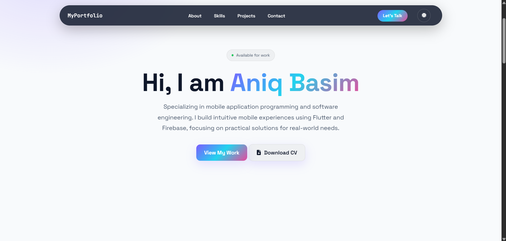

# MyPortfolio – Personal Developer Portfolio

## Description

MyPortfolio is a responsive personal portfolio website developed to showcase my background, technical skills, and software development projects. The website highlights my interest in mobile and web development while presenting my work in a modern and user-friendly interface.

This project was developed as part of the CSD34203 Special Topics in Software Development course.

---

## Features

* Responsive modern portfolio design
* Dark mode and light mode toggle
* About Me section
* Skills and technologies section
* Project showcase section
* Blog section with sample posts
* Contact section with social links
* Smooth and clean user interface
* Firebase deployment support

---

## Technologies Used

* HTML5
* CSS3
* JavaScript
* Firebase Hosting
* Git & GitHub
* Font Awesome
* Google Fonts

---

## Project Structure

```text
portfolio/
│
├── public/
│   ├── index.html
│   ├── 404.html
│   ├── css/
│   │   └── styles2.css
│   └── images/
│       ├── basim.jpg
│       └── frontpage.png
│
├── .firebase/
├── .vscode/
├── firebase.json
├── .firebaserc
├── .gitignore
└── README.md
```

---

## Screenshots

### Home Page



---

## Featured Projects

### MyCat – Pet Care Tracker

A comprehensive mobile application for feline health management featuring appointment reminders and breed identification capabilities.

#### Technologies Used

* Flutter
* Firebase
* Workmanager

---

### I-RHS System

A web-based in-and-out college management system for students at Politeknik Sultan Mizan Zainal Abidin.

#### Technologies Used

* PHP
* HTML
* CSS
* JavaScript
* CodeIgniter 4

---

## How to Run the Project

### 1. Clone the repository

```bash
git clone https://github.com/yourusername/your-repository-name.git
```

### 2. Open the project folder

```bash
cd your-repository-name
```

### 3. Run the project

Open `index.html` in your browser.

---

## Live Demo

https://yourproject.web.app

---

## Challenges Faced

* Managing Firebase cache updates after deployment
* Creating a responsive navigation layout
* Implementing dark and light mode functionality
* Organizing clean UI spacing and styling

---

## Solutions Implemented

* Used CSS versioning to prevent cache issues
* Applied Flexbox for responsive alignment
* Used localStorage to save theme preferences
* Improved UI consistency with reusable design styling

---

## Future Improvements

* Add project filtering system
* Improve mobile navigation menu
* Add animations and transition effects
* Integrate downloadable resume feature
* Add backend contact form support

---

## Author

### Aniq Basim Bin Ramza

Final Year Undergraduate Student in Software Engineering

Interested in:

* Mobile Development
* Web Development
* Software Engineering
* UI/UX Design

---

## License

This project is developed for educational purposes under the CSD34203 Special Topics in Software Development course.
